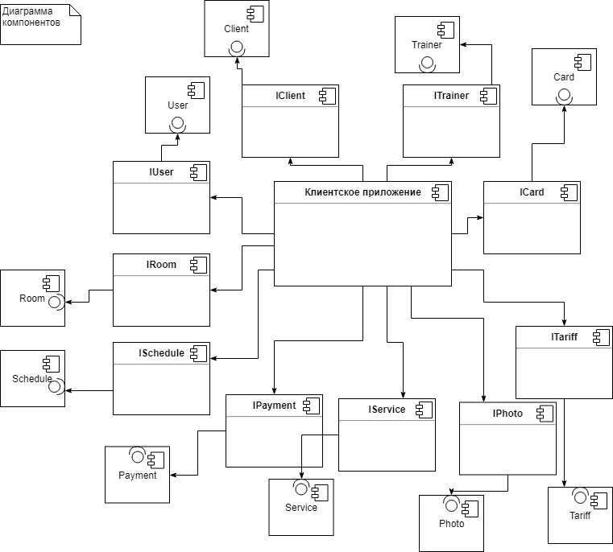

## Документация на API FitOS

Целью создания системы является повышение эффективности работы фитнес-центра за счет автоматизации следующих бизнес-процессов: регистрация клиентов, заключение договоров с ними, составление расписаний работы тренеров и помещений, расчет загруженности помещений (то есть, отражение количества занятых и свободных мест), отслеживание платежей, хранение информации о всех клиентах, тренерах, помещениях, тарифах и картах клиентов, удаленное самостоятельное бронирование занятий клиентами. 

## Диаграмма размещения

 
*Рисунок 1 Диаграмма размещения*
 
На диаграмме размещения изображены узлы выполнения программных компонентов, а также объектов. Показано, что клиентское приложение, установленное на компьютере пользователя, взаимодействует с сервером, который содержит в себе базу данных.

## Диаграмма компонентов

*Рисунок 2 Диаграмма компонентов*

На данной диаграмме изображены все компоненты: клиентское приложение, работники, клиенты, услуги, расписание, помещения, карты, тарифы, платежи, пользователи. Эти компоненты взаимодействуют друг с другом с помощью интерфейсов.

## Диаграмма интерфейсов

*Рисунок 3 Диаграмма интерфейсов*

*Список интерфейсов:*

+ [IUser](#IUser);
+ [IClient](#IClient);
+ [ITrainer](#ITrainer);
+ [IPhoto](#IPhoto);
+ [IService](#IService);
+ [ITariff](#ITariff);
+ [IRoom](#IRoom);
+ [ICard](#ICard);
+ [ISchedule](#ISchedule);
+ [IPayment](#IPayment);

<a name="IUser">[**IUser**](./IUser.md)</a>
-----

+ +Del(ID : int) : bool - функция удаления пользователя;

+ +Validation(Login:string, Password:string) : bool - функция проверки логина и пароля, вводимых пользователем.

<a name="IClient">[**IClient**](./IClient.md)</a>
-----

+ +Add(FIO:string, Sex:bool, Height:int, Weight:int, Health:int, Phone:int, DOB:DateTime, Comment:string): int – функция добавления пользователя в БД;

+ +Save(FIO:string, Sex:bool, Height:int, Weight:int, Health:int, Phone:int, DOB:DateTime, Comment:string) : bool – функция сохранения изменений;

+ +GetAll() : List<[Client](https://github.com/qwertyKEK/my/blob/master/IClient.md#%D0%BE%D0%BF%D0%B8%D1%81%D0%B0%D0%BD%D0%B8%D0%B5-%D0%BA%D0%BB%D0%B0%D1%81%D1%81%D0%B0-client)> - выводит список всех клиентов;

+ +FindClientByID(ID : int) : [Client](https://github.com/qwertyKEK/my/blob/master/IClient.md#%D0%BE%D0%BF%D0%B8%D1%81%D0%B0%D0%BD%D0%B8%D0%B5-%D0%BA%D0%BB%D0%B0%D1%81%D1%81%D0%B0-client)- поиск клиента по ID;

<a name="ITrainer">[**ITrainer**](./ITrainer.md)</a>
-----

+ +GetAll() : List<[Trainer](https://github.com/qwertyKEK/my/blob/master/ITrainer.md#%D0%BE%D0%BF%D0%B8%D1%81%D0%B0%D0%BD%D0%B8%D0%B5-%D0%BA%D0%BB%D0%B0%D1%81%D1%81%D0%B0-trainer)> - выводит список всех тренеров;

+ +FindTrainerByID(ID : int) : [Trainer](https://github.com/qwertyKEK/my/blob/master/ITrainer.md#%D0%BE%D0%BF%D0%B8%D1%81%D0%B0%D0%BD%D0%B8%D0%B5-%D0%BA%D0%BB%D0%B0%D1%81%D1%81%D0%B0-trainer) - поиск тренера по ID;

+ +Add(FIO:string, Sex:bool,  Qualification:string, Phone:int, DOB:DateTime, Comment:string) : int - функция добавления тренера в БД.

<a name="IPhoto">[**IPhoto**](./IPhoto.md)</a>
-----

+ +Add(URL : string) : int – функция добавления фото в БД;

+ +Del(ID : int) : bool – функция удаления фото (Присвоение статуса «удаленный»).

<a name="IService">[**IService**](./IService.md)</a>
-----

+ +Add(Name:string, Cost:int, Comment:string) : int – функция добавления услуги в БД;

+ +Del(ID : int) : bool – функция удаления услуги (Присвоение статуса «удаленная»);

+ +Save(Name:string, Cost:int, Comment:string) : bool – функциясохраненияизменений;

+ +GetAll() : List<[Service](https://github.com/qwertyKEK/my/blob/master/IService.md#%D0%BE%D0%BF%D0%B8%D1%81%D0%B0%D0%BD%D0%B8%D0%B5-%D0%BA%D0%BB%D0%B0%D1%81%D1%81%D0%B0-service)> - вывести список всех услуг;

+ +GetTrainers(IDServise : int) : List<[Trainer](https://github.com/qwertyKEK/my/blob/master/ITrainer.md#%D0%BE%D0%BF%D0%B8%D1%81%D0%B0%D0%BD%D0%B8%D0%B5-%D0%BA%D0%BB%D0%B0%D1%81%D1%81%D0%B0-trainer)> - вывести всех тренеров услуги;

+ +FindServiceByID(ID : int) : [Service](https://github.com/qwertyKEK/my/blob/master/IService.md#%D0%BE%D0%BF%D0%B8%D1%81%D0%B0%D0%BD%D0%B8%D0%B5-%D0%BA%D0%BB%D0%B0%D1%81%D1%81%D0%B0-service) - поискуслугипо ID;

+ +GetBalanceService(IDCard : int) : Dictionary<string, int> - показать баланс карты, то есть количество услуги на карте;

+ +GetBalanceFrost(IDCard : int) :  Dictionary<string, int> - показать количество дней заморозки.

<a name="ITariff">[**ITariff**](./ITariff.md)</a>
-----

+ +Add(Name:string, Duration:int, TotalCost:float, StartDate:DateTime, DateRemoved:DateTime) : int - Добавить новый тариф;

+ +GetServices(ID : int) : List<[Service](https://github.com/qwertyKEK/my/blob/master/IService.md#%D0%BE%D0%BF%D0%B8%D1%81%D0%B0%D0%BD%D0%B8%D0%B5-%D0%BA%D0%BB%D0%B0%D1%81%D1%81%D0%B0-service)> - показать услуги по тарифу;

+ +Del(ID : int) : bool – функция удаления тарифа (Присвоение статуса «удаленный»);

+ +Save(Name:string, Duration:int, TotalCost:float, StartDate:DateTime, DateRemoved:DateTime) : bool – функция сохранения изменений;

+ +GetAll(ID : int) : List<[Tariff](https://github.com/qwertyKEK/my/blob/master/ITariff.md#%D0%BE%D0%BF%D0%B8%D1%81%D0%B0%D0%BD%D0%B8%D0%B5-%D0%BA%D0%BB%D0%B0%D1%81%D1%81%D0%B0-tariff)> - вывести список всех тарифов;

+ +FindTarrifsByID(ID : int) - найти тариф по ID;

+ +AddServiceInTariff(IDService : int, IDTariff : int, Periodicity : int, Amount : int) : bool - добавить услугу в тариф.

<a name="IRoom">[**IRoom**](./IRoom.md)</a>
-----

+ +Add(Name:string, Equipment:string, Capacity:int,Comment:string) : int - Добавить помещение;

+ +Del(ID : int) : bool – функция удаления помещение (Присвоение статуса «удаленное»);

+ +Save(Name:string, Equipment:string, Capasity:int,Comment:string) : bool – функция сохранения изменений;

+ +GetAll() : List<[Room](https://github.com/qwertyKEK/my/blob/master/IRoom.md#%D0%BE%D0%BF%D0%B8%D1%81%D0%B0%D0%BD%D0%B8%D0%B5-%D0%BA%D0%BB%D0%B0%D1%81%D1%81%D0%B0-room)> - вывести список всех помещений;

+ +FindRoomByID(ID : int) : [Room](https://github.com/qwertyKEK/my/blob/master/IRoom.md#%D0%BE%D0%BF%D0%B8%D1%81%D0%B0%D0%BD%D0%B8%D0%B5-%D0%BA%D0%BB%D0%B0%D1%81%D1%81%D0%B0-room) - поискпо ID;

+ +GetScheduleRoomByTime(ID:int) : Dictionary<DateTime,string> - показать расписание помещения

<a name="ICard">[**ICard**](./ICard.md)</a>
-----
+ +Add(IDTariff: int, IDClient: int) : int - Добавить карту;

+ +Del(ID : int) : bool – функция удаления карты (Присвоение статуса «удаленная»);

+ +Save(IDTariff: int) : bool – функция сохранения изменений;

+ +GetAll() : List<[Card](https://github.com/qwertyKEK/my/blob/master/ICard.md#%D0%BE%D0%BF%D0%B8%D1%81%D0%B0%D0%BD%D0%B8%D0%B5-%D0%BA%D0%BB%D0%B0%D1%81%D1%81%D0%B0-card)> - вывести список всех карт;

+ +FindCardByID(ID : int) : [Card](https://github.com/qwertyKEK/my/blob/master/ICard.md#%D0%BE%D0%BF%D0%B8%D1%81%D0%B0%D0%BD%D0%B8%D0%B5-%D0%BA%D0%BB%D0%B0%D1%81%D1%81%D0%B0-card) - поискпо ID;

+ +AddVisit(IDCard : int, IDService : int) : int - добавить посещение;

+ +DelVisit(IDCard : int, IDService : int) : bool - удалить посещение;

+ +FrostCard(IDCard : int, StartDate : DateTime, EndDate : DateTime) : bool - заморозка карты

<a name="ISchedule">[**ISchedule**](./ISchedule.md)</a>
-----

+ +Add(Trainer : [Trainer](https://github.com/qwertyKEK/my/blob/master/ITrainer.md#%D0%BE%D0%BF%D0%B8%D1%81%D0%B0%D0%BD%D0%B8%D0%B5-%D0%BA%D0%BB%D0%B0%D1%81%D1%81%D0%B0-trainer), Card : [Card](https://github.com/qwertyKEK/my/blob/master/ICard.md#%D0%BE%D0%BF%D0%B8%D1%81%D0%B0%D0%BD%D0%B8%D0%B5-%D0%BA%D0%BB%D0%B0%D1%81%D1%81%D0%B0-card), Service : [Service](https://github.com/qwertyKEK/my/blob/master/IService.md#%D0%BE%D0%BF%D0%B8%D1%81%D0%B0%D0%BD%D0%B8%D0%B5-%D0%BA%D0%BB%D0%B0%D1%81%D1%81%D0%B0-service), Room : [Room](https://github.com/qwertyKEK/my/blob/master/IRoom.md#%D0%BE%D0%BF%D0%B8%D1%81%D0%B0%D0%BD%D0%B8%D0%B5-%D0%BA%D0%BB%D0%B0%D1%81%D1%81%D0%B0-room), Date : DateTime) : int - Добавитьзапись;

+ +Del(ID : int) : bool – функция удаления запись (Присвоение статуса «удаленная»);

+ +Save(Trainer : [Trainer](https://github.com/qwertyKEK/my/blob/master/ITrainer.md#%D0%BE%D0%BF%D0%B8%D1%81%D0%B0%D0%BD%D0%B8%D0%B5-%D0%BA%D0%BB%D0%B0%D1%81%D1%81%D0%B0-trainer), Card : [Card](https://github.com/qwertyKEK/my/blob/master/ICard.md#%D0%BE%D0%BF%D0%B8%D1%81%D0%B0%D0%BD%D0%B8%D0%B5-%D0%BA%D0%BB%D0%B0%D1%81%D1%81%D0%B0-card), Service : [Service](https://github.com/qwertyKEK/my/blob/master/IService.md#%D0%BE%D0%BF%D0%B8%D1%81%D0%B0%D0%BD%D0%B8%D0%B5-%D0%BA%D0%BB%D0%B0%D1%81%D1%81%D0%B0-service), Room : [Room](https://github.com/qwertyKEK/my/blob/master/IRoom.md#%D0%BE%D0%BF%D0%B8%D1%81%D0%B0%D0%BD%D0%B8%D0%B5-%D0%BA%D0%BB%D0%B0%D1%81%D1%81%D0%B0-room), Date : DateTime) : bool – функция сохранения изменений;

+ +AddFrost( StartDate : DateTime, EndDate : DateTime, IDCard:int) : bool - заморозить карту;

+ +GetAll() : List<[Schedule](https://github.com/qwertyKEK/my/blob/master/ISchedule.md#%D0%BE%D0%BF%D0%B8%D1%81%D0%B0%D0%BD%D0%B8%D0%B5-%D0%BA%D0%BB%D0%B0%D1%81%D1%81%D0%B0-schedule)> - вывести список всех записей;

<a name="IPayment">[**IPayment**](./IPayment.md)</a>
-----

+ +Add(IDClient:int, Date:DateTime, Amount:int) : int - Добавить платеж;

+ +Del(ID : int) : bool – функция удаления платежа из БД;

+ +GetAll() : List<[Payment](https://github.com/qwertyKEK/my/blob/master/IPayment.md#%D0%BE%D0%BF%D0%B8%D1%81%D0%B0%D0%BD%D0%B8%D0%B5-%D0%BA%D0%BB%D0%B0%D1%81%D1%81%D0%B0-payment)> - вывести список всех платежей.

